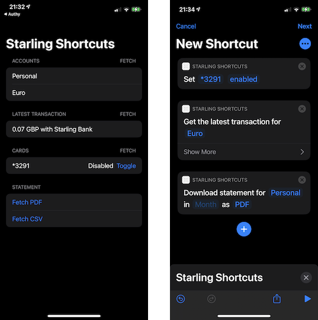

# StarlingShortcuts
This is an early-stage project that enables Starling Bank account holders to manage their accounts through Siri Shortcuts. It uses the [Starling Bank API](https://developer.starlingbank.com/docs) to make changes to users' accounts.  

The project is intended to be a proof-of-concept as I don't have a huge amount of time to update it regularly. It uses SwiftUI, Combine, and URLSession. I do not condone the use of this app with a real Starling Bank account and am not responsible for the effects if anyone builds this project code using their real Personal Access Token. All examples have been tested and recorded using a sandbox account.

### Shortcut Ideas
:white_check_mark: Get Latest Transaction  
:white_check_mark: Enable or Disable Card  
[ ] Download Statement  
[ ] Submit Recceipt  
[ ] Move Money To/From Space  
[ ] Get Recurring Transactions  
[ ] Get Spending Insights  
[ ] Get Account Balance  

### Screenshots

